# Behavior Cloning

## Goal

The goal of Behavoir Cloning project is to build model that controls vehicle. The model should keep the
vehicle driving on the road.

## Files

The project includes

  * `dataset.py` - builds train and validation datasets using driving logs
  
  * `sahist.py` - generates a steering angle histogram for a dataset
  
  * `model.py` - trains a model
  
  * `model.h5` - the trained model
  
  * `drive.py` - tests the trained model using Udacity Simulator
  
  * `tvloss.py` - draws a losses plot
  
  * `video.py` - generates `video.mp4`
  
  * `video.mp4` - a video of one try
  
## Experiments

The process of model building was incremental and contained following steps

  - build dataset: collect and augment data
  - train model using collected data
  - run `drive.py` to be sure the model keep vehicle driving on track
  - collect more data (for corner cases) or correct model architecture (add normalization, add cropping, add dropouts, ...) and build second dataset
  - train model again ...
 
My first step was to use a LeNet-5 CNN. I thought this model might be appropriate because it was good choice
for Signs classification problem. But experiment showed that LeNet-5 is not best choice for steering
angle prediction task. NVidia CNN shows better results.
 
The description of final dataset and neural network you can find below. 

## Data Set

The latest Udacity Simulator was used to collect data. DualShock 4 controller was also employed (my DS4Windows configuration could be found here - `stuff/ds4.xml`).  

`dataset.py` is a main script that reads driving logs (output of Udacity Simulator), generates augmented data (using images from left and right cameras with steering angle correction (0.2)), shuffles data, splits data to train set and validation set (20%), and stores them to HDF5.

### Data Collection Strategy

The main strategy to collect data was the "incremental strategy". I collect data step-by-step. When I noticed that model performed poorly in some cases I added more data to correct this "bad" behavior. I continued the "collect-train-check" loop until the car relinquished its attempts to sink	in the lake (however, I decided to put up with the fact that the car was still afraid of shadows). The final list of driving logs could be found in `dataset.ps1`.

The data about the following kinds of trajectories was collected:

  * center driving (clockwise and counter clockwise)
  
  * recover from side (clockwise and counter clockwise)
  
  
### Data Set Exploration

The draining dataset contains `24565` points in training set and `6148` points in validation set.

As it was mentioned above the data set includes 2 kind of trajectories. These images show images for each kind of trajectory:

_center driving_

  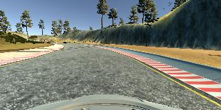
  
  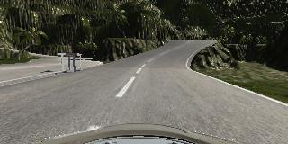
  
_recovering from side_

  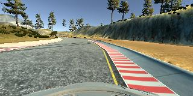
  
  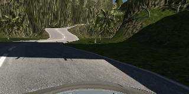

#### Flipping
To generate more data collected data was augmented. Below you can see flipped images:

_center driving flipped_

  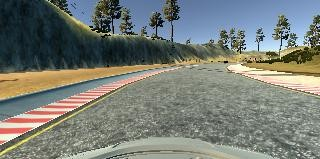

_recovering from side flipped_

  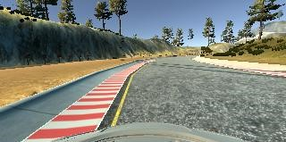

For flipped images sign of steering angle value was changed to opposite.

#### Left and Right cameras

Images from Left and Right cameras were used. Steering angle for these images was corrected with `0.2` value.

Examples:

_left camera image_

  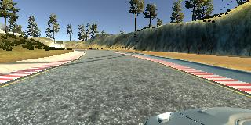
  
_right camera image_

  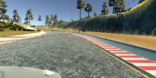

#### Sterring Angle Histogram
Here is a "steering angle" histogram for a final dataset:

  
  
Note: the histogram is generated by `sahist.py`.

Apparently, it is a right-assymetry histogram (between 0 and 0.25 angles).

## Neural Network

### Type of Neural Network

The model should predict steering angle. So the objective is to build a regressor.

### Architecture

I used NVidia CNN with one cropping layer and one dropout layers (with keep probability 0.5) (see https://arxiv.org/pdf/1604.07316.pdf for more details):

	_________________________________________________________________
	Layer (type)                 Output Shape              Param #
	=================================================================
	lambda_1 (Lambda)            (None, 160, 320, 3)       0
	_________________________________________________________________
	cropping2d_1 (Cropping2D)    (None, 75, 320, 3)        0
	_________________________________________________________________
	conv2d_1 (Conv2D)            (None, 36, 158, 24)       1824
	_________________________________________________________________
	conv2d_2 (Conv2D)            (None, 16, 77, 36)        21636
	_________________________________________________________________
	conv2d_3 (Conv2D)            (None, 6, 37, 48)         43248
	_________________________________________________________________
	conv2d_4 (Conv2D)            (None, 4, 35, 64)         27712
	_________________________________________________________________
	conv2d_5 (Conv2D)            (None, 2, 33, 64)         36928
	_________________________________________________________________
	dropout_1 (Dropout)          (None, 2, 33, 64)         0
	_________________________________________________________________
	flatten_1 (Flatten)          (None, 4224)              0
	_________________________________________________________________
	dense_1 (Dense)              (None, 100)               422500
	_________________________________________________________________
	dense_2 (Dense)              (None, 50)                5050
	_________________________________________________________________
	dense_3 (Dense)              (None, 10)                510
	_________________________________________________________________
	dense_4 (Dense)              (None, 1)                 11
	=================================================================
	Total params: 559,419
	Trainable params: 559,419
	Non-trainable params: 0
    
#### Preprocessing layers

The model contains one normalization layer (`lambda_1`)

    model.add(Lambda(lambda x: x / 255.0 - 0.5, input_shape=(160, 320, 3)))

and one cropping layer (`cropping2d_1`)

    model.add(Cropping2D(cropping=((60, 25), (0, 0))))
    
Below you can see training loss plots for models without preprocessing layer and without cropping layer:

_no preprocessing, no cropping_

  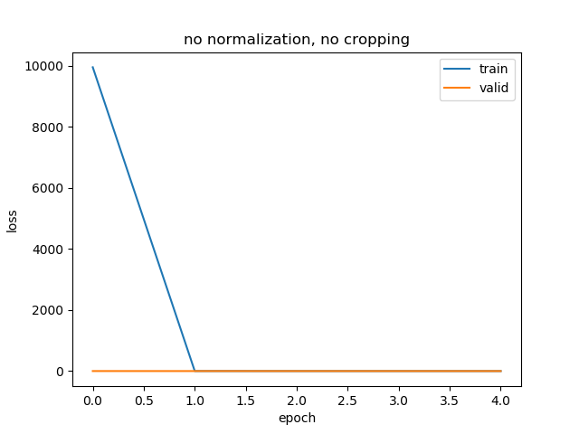

_no cropping_

  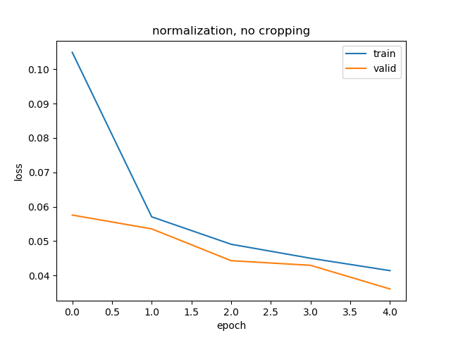
  
#### Overfitting Handling

To reduce overfitting one dropout layer with keep probability `0.5` was added (`dropout_1`).
    
### Loss function

`Mean squared error` function was used as loss function. This is most popular choice for regression tasks.
    
### Training

Adam optimizer was used. Learning rate was not tuned manually.

#### Hyperparameters

  * Epochs 6 (it's enough to reach validation loss ~0.04)
  
  * Batch Size 256
  
#### Training/Validation Loss Plot

  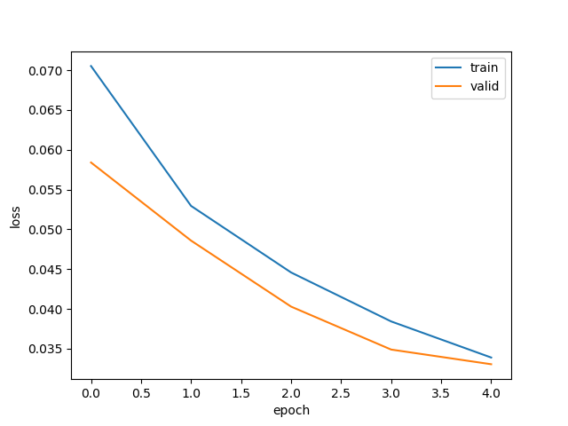
  
The final validation loss is 0.033. It's good enough. The model with the loss of 0.2 looks like
an overfitted model.
  
## About second track

The model dispays incorrect behavior on Track 2. I suppose I need to collect more data or
use more advanced augmentation techniques.
  
## Software & Libraries

  * Udacity Simulator
  
  * DS4Windows
  
  * GNU Octave
  
  * http://github.com/zasimov/udacitylib - this is my own library with some useful stuff

