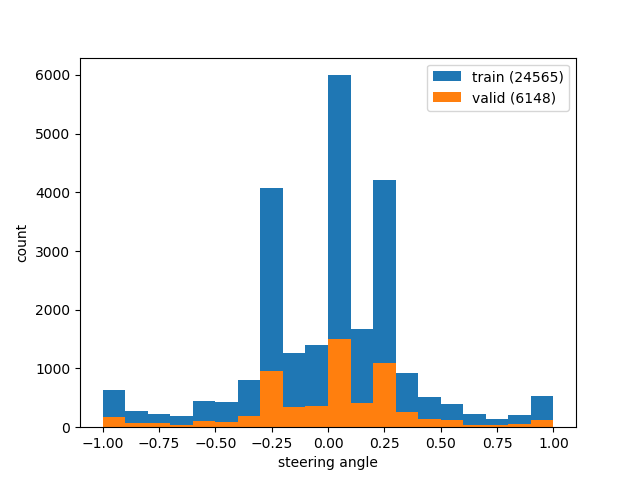

# Behavior Cloning

## Files

The project includes

  * `dataset.py` - builds train and validation datasets using driving logs
  
  * `sahist.py` - generates a steering angle histogram for a dataset
  
  * `model.py` - trains a model
  
  * `model.h5` - the trained model
  
  * `drive.py` - tests the trained model using Udacity Simulator
  
  * `tvloss.py` - draws a losses plot
  
  * `video.py` - generates `video.mp4`
  
  * `video.mp4` - a video of one try

## Data Set

The latest Udacity Simulator was used to collect data. DualShock 4 controller was also employed (my DS4Windows configuration could be found here - `stuff/ds4.xml`).  

`dataset.py` is a main script that reads driving logs (output of Udacity Simulator), generates augmented data (using images from left and right cameras with steering angle correction (0.2)), shuffles data, splits data to train set and validation set (20%), and stores them to HDF5.

The main strategy to collect data was the "incremental strategy". I collect data step-by-step. When I noticed that model performed poorly in some cases I added more data to correct this "bad" behavior. I continued the "collect-train-check" loop until the car relinquished its attempts to sink	in the lake (however, I decided to put up with the fact that the car was still afraid of shadows). The final list of driving logs could be found in `dataset.ps1`.

The data about the following kinds of trajectories was collected:

  * center driving
  
  * recover from side
  
  * counter clockwise center driving

Here is a "steering angle" histogram for a final dataset:

  
  
Note: the histogram is generated by `sahist.py`.

Apparently, it is a right-assymetry histogram (between 0 and 0.25 angles). 

## Neural Network

I used NVidia CNN with one cropping layer and one dropout layers (with keep probability 0.5) (see https://arxiv.org/pdf/1604.07316.pdf for more details):

	_________________________________________________________________
	Layer (type)                 Output Shape              Param #
	=================================================================
	lambda_1 (Lambda)            (None, 160, 320, 3)       0
	_________________________________________________________________
	cropping2d_1 (Cropping2D)    (None, 75, 320, 3)        0
	_________________________________________________________________
	conv2d_1 (Conv2D)            (None, 36, 158, 24)       1824
	_________________________________________________________________
	conv2d_2 (Conv2D)            (None, 16, 77, 36)        21636
	_________________________________________________________________
	conv2d_3 (Conv2D)            (None, 6, 37, 48)         43248
	_________________________________________________________________
	conv2d_4 (Conv2D)            (None, 4, 35, 64)         27712
	_________________________________________________________________
	conv2d_5 (Conv2D)            (None, 2, 33, 64)         36928
	_________________________________________________________________
	dropout_1 (Dropout)          (None, 2, 33, 64)         0
	_________________________________________________________________
	flatten_1 (Flatten)          (None, 4224)              0
	_________________________________________________________________
	dense_1 (Dense)              (None, 100)               422500
	_________________________________________________________________
	dense_2 (Dense)              (None, 50)                5050
	_________________________________________________________________
	dense_3 (Dense)              (None, 10)                510
	_________________________________________________________________
	dense_4 (Dense)              (None, 1)                 11
	=================================================================
	Total params: 559,419
	Trainable params: 559,419
	Non-trainable params: 0
    
### Training

Adam optimizer was used. 

#### Hyperparameters

  * Epochs 6 (it's enough to reach validation loss ~0.04)
  
  * Batch Size 256
  
#### Training/Validation Loss Plot

  
  
The final validation loss is 0.033. It's good enough. The model with the loss of 0.2 looks like
an overfitted model.
  
## About second track

The model dispays incorrect behavior on Track 2. I suppose I need to collect more data or
use more advanced augmentation techniques.
  
## Software & Libraries

  * Udacity Simulator
  
  * DS4Windows
  
  * GNU Octave
  
  * http://github.com/zasimov/udacitylib - this is my own library with some useful stuff

